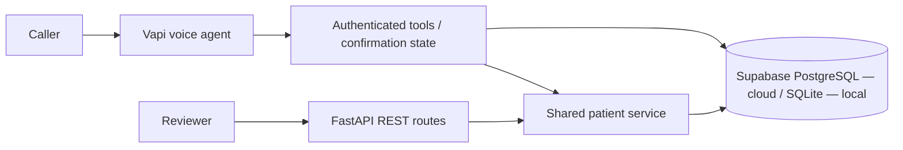

# Patient Registration Demo

A staged implementation of the Voice AI Agent assessment: FastAPI patient APIs,
Supabase persistence, a Vapi voice assistant, and browser calling on Vercel Hobby.
The public API and synthetic voice-tool workflow are verified. Real spoken
conversation and telephone reachability still require user testing.
Use fictional data only; this is not a production healthcare system.

- Demo: https://patient-registration-demo-roan.vercel.app
- API docs: https://patient-registration-demo-roan.vercel.app/docs
- Phone: +1 (406) 635-1082 (international access unverified; carrier charges may apply)
- Repository: https://github.com/sandesh40/patient-registration-demo

The deployed application runs independently of the developer's laptop. Vapi handles
the ongoing voice connection; Vercel handles short API requests and Supabase stores
the data. The browser needs to stay open during a browser call.

## Architecture



Vapi owns transcription, the conversational LLM, speech synthesis, and the live
call. FastAPI handles short database requests, making it suitable for Vercel
Functions. The service layer is independent of HTTP and can also be invoked by
Vapi tool handlers. No patient state is kept in application memory.

| Technology | Purpose |
| --- | --- |
| FastAPI + Uvicorn | Typed REST routes, OpenAPI/Swagger, ASGI server |
| Pydantic + pydantic-settings | Request validation and environment configuration |
| SQLAlchemy 2 + Psycopg 3 | Parameterized queries, transactions, PostgreSQL access |
| Alembic | Explicit, versioned migrations; no schema changes on API startup |
| Supabase PostgreSQL | Persistent cloud database independent of app restarts |
| SQLite | Zero-account local development and isolated tests |
| pytest + coverage + Ruff | Behavioral tests, coverage reporting, formatting/linting |

## Local setup

Requires Python 3.12 or newer. The initial implementation was tested on Python 3.14.
Run commands from the repository root:

```bash
python3 -m venv .venv
source .venv/bin/activate
python -m pip install -r requirements-dev.txt
cp .env.example .env
alembic upgrade head
uvicorn app.main:app --reload
```

Open [Swagger UI](http://127.0.0.1:8000/docs) or
[ReDoc](http://127.0.0.1:8000/redoc). `/health` checks the process; `/ready` checks
database access and the presence of the patient table.

SQLite data is stored in `data/patients.db` and survives process restarts.
Do not deploy this local database to an ephemeral/serverless filesystem.

## Environment variables

Keep `.env` local; it and all populated `.env.*` files are Git-ignored. Never put
database passwords, provider keys, or API tokens into source files or the README.

| Variable | Usage |
| --- | --- |
| `DATABASE_URL` | SQLite URL locally; Supabase **transaction pooler** URL in deployment |
| `APP_ENV` | `development` (default), `test`, or `production` |
| `API_AUTH_TOKEN` | Optional locally; production requires at least 32 characters |
| `LOG_LEVEL` | `DEBUG`, `INFO` (default), `WARNING`, or `ERROR` |
| `VAPI_API_KEY` | Private key used only by Vapi configuration/check scripts |
| `VAPI_ASSISTANT_ID` | Assistant ID; reject webhook calls identifying another assistant |
| `VAPI_PHONE_NUMBER_ID` | Phone resource ID used by the routing configuration script |
| `VAPI_WEBHOOK_SECRET` | Separate bearer token required on `/vapi/webhook` |
| `VAPI_SERVER_CREDENTIAL_ID` | Vapi server credential containing the webhook bearer token |
| `VAPI_MODEL` | Configuration-script model, default `gemini-2.5-flash` |
| `VAPI_PUBLIC_KEY` | Intentionally public browser SDK key, restricted to the demo origins and assistant |

For Supabase, copy **Connect → Transaction pooler** and replace the password
placeholder (percent-encode any reserved characters in the password). The backend
selects Psycopg automatically for `postgresql://` URLs. SSL is required; prepared
statements are disabled, and `NullPool` leaves pooling to Supabase. Run
`alembic upgrade head` explicitly against the intended database before serving
requests. The PostgreSQL migration enables row-level security without public Data
API policies: the backend connects using the project's database-owner credential.

Production requires PostgreSQL and an API token. Send the token using
`Authorization: Bearer <token>`; Swagger's **Authorize** button supports it. The
health endpoints and documentation are public. CORS is not opened to arbitrary
websites. Vapi webhook authentication uses its own token and fails closed when unset.

## API contract

| Method | Route | Behavior |
| --- | --- | --- |
| `GET` | `/patients` | List active records, optionally filter by `last_name`, `date_of_birth`, `phone_number` |
| `GET` | `/patients/{patient_id}` | Fetch one active record by UUID |
| `POST` | `/patients` | Create a validated patient, return 201 and a `Location` header |
| `PUT` | `/patients/{patient_id}` | Update supplied fields only; omitted fields are preserved |
| `DELETE` | `/patients/{patient_id}` | Set `deleted_at`, return 200 with the retained record |

Success: `{"data": <record or array>, "error": null}`.

Failure:

```json
{
  "data": null,
  "error": {
    "code": "validation_error",
    "message": "Please correct the indicated fields",
    "details": [{"field": "phone_number", "message": "...", "code": "value_error"}]
  }
}
```

- Dates of birth use **MM/DD/YYYY** in request bodies, filters, and responses.
  Internally they use a real SQL `DATE`. Invalid dates and future dates are rejected.
- Phone numbers use ten digits, without `+1` or punctuation; NANP area/exchange
  prefixes must start with 2–9. The voice tools normalize punctuation and `+1`;
  the LLM converts spoken digits into strings.
- Names accept A–Z letters, hyphens, and apostrophes, 1–50 characters. At least
  one letter is required. State codes are normalized to uppercase; 50 states and DC
  are accepted. ZIP codes allow five digits or `12345-6789`.
- Optional fields may be omitted or `null`, except `preferred_language`, which
  defaults to English when omitted. To clear a nullable field on PUT, send `null`.
  Required fields cannot be cleared. Empty strings are not a substitute for null.
- Sex accepts `Male`, `Female`, `Other`, or `Decline to Answer`.
- All PDF fields are represented; UUID, UTC `created_at`, and UTC `updated_at` are
  generated by the application. `deleted_at` is added for soft deletion.
- Last-name filtering is case-insensitive exact matching. Multiple filters combine
  with AND. Deleted records are excluded from list, lookup, update, and repeated
  deletion (404); the row remains in the database.
- Invalid field values return 422; malformed JSON and empty updates return 400;
  missing patients return 404; database/internal errors return 500 with sanitized
  messages. Authentication failures return 401. Error details never echo input
  payloads or database connection strings.
- The API logs record-operation IDs. After a confirmed voice transaction commits,
  `voice_registration_confirmed` logs the final fictional demographic payload.

Create and search a fictional patient:

```bash
curl -i http://127.0.0.1:8000/patients \
  -H 'Content-Type: application/json' \
  --data-binary @examples/patient.json

curl 'http://127.0.0.1:8000/patients?last_name=Doe&date_of_birth=04%2F15%2F1990'
```

If authentication is enabled, add `-H "Authorization: Bearer $API_AUTH_TOKEN"`.

## Testing

Part 3 verification: **125 backend tests and 5 browser tests**, with **98% application
coverage** on the backend suite. The
optional disposable-PostgreSQL test is skipped unless configured. Part 1 also passed
that test on PostgreSQL 18. The supplied Supabase project has migrations through
`0002` applied; its Alembic drift check passed. The live Supabase smoke test also
passed concurrent confirmation retries, restart persistence, confirmed updates,
transcript linkage, and soft deletion. The public Vercel smoke test passed readiness,
authenticated preparation/save/retry/retrieval, and synthetic-record cleanup. These
checks used synthetic tool requests, not audio.
See the voice guide for repeating cloud smoke testing.

```bash
pytest -q --cov=app --cov-report=term-missing
ruff check app tests migrations scripts
ruff format --check app tests migrations scripts
```

Tests run real Alembic migrations against fresh on-disk SQLite databases. They
cover field rules, all CRUD routes, filters, correction/update semantics, soft
deletion, authentication, transaction rollback after a simulated database failure,
and retrieval from a new application instance after shutdown. Database constraints
are tested separately using SQL writes that bypass Pydantic.

An additional PostgreSQL integration test exercises migration compatibility,
CRUD, persistence, row-level security, and SQL constraints. Set
`TEST_POSTGRES_URL` to a **disposable database whose name ends in `_test`** and run:

```bash
pytest -q -m postgres
```

Never point this at the Supabase demo database. The integration test removes its
test table on completion. It is skipped when the variable is absent.

`requirements.txt` and `requirements-dev.txt` pin the tested dependency set;
`pyproject.toml` specifies the supported ranges. A GitHub Actions workflow will run
linting, formatting, and the SQLite suite on Python 3.12 and 3.14 when pushed.
Browser sources are in `web/src`, with a pinned SDK/build-tool lockfile. The built
bundle is committed under `public/assets` so Vercel's Python deployment does not
need a Node build step. To change or test the page:

```bash
npm ci --prefix web
npm run build --prefix web
web/node_modules/.bin/playwright install chromium
mkdir -p data
npm test --prefix web
```

Browser tests mock Vapi and consume no credits. GitHub Actions also checks the
bundle is current and runs the browser tests. The current Starlette/AnyIO combination emits one upstream deprecation warning
about `BlockingPortal`; it does not affect test results.

## Voice integration

The [voice guide](docs/voice-integration.md) covers the prompt, tool sequence,
authentication, configuration, cloud smoke test, and live-call test cases.
The applied configuration uses **Gemini 2.5 Flash**, Deepgram Nova 3 transcription,
and Deepgram Asteria speech, with a ten-minute call limit. The assistant and each
custom tool use the deployed webhook with a Vapi bearer credential.
No separate Gemini API key is required by this configuration; it uses Vapi-managed
provider billing and calls consume the account's finite credits.

Voice drafts, confirmation tokens, idempotency receipts, and transcripts live in
PostgreSQL. `prepare_registration` returns a full readback without writing a patient.
Only `confirm_registration` saves the prepared snapshot, in the same transaction
as the retry receipt. Corrections invalidate the previous token. Returning-patient
updates require a phone-and-DOB lookup and reject concurrent changes to the record.

## Known limitations and trade-offs

- The cloud backend and Vapi configuration are deployed. A **real spoken call has
  not yet been verified**, so conversational quality and phone compliance remain
  open review items. Browser UI tests use a mocked SDK and are not audio tests.
- The LLM interprets spoken confirmation. The server enforces a prepared snapshot,
  matching token, strict boolean, and separate confirmation tool request; it does
  not independently prove from audio that a caller said yes. Live prompt testing is
  still required. Phone and DOB lookup is demo matching, not identity verification.
- End-of-call transcripts are stored only when Vapi sends them. Drafts and tool
  receipts contain fictional demographics and have no automated retention purge yet.
- Free Vapi numbers are documented for U.S. national use. Incoming access from
  Pakistan is not verified. A browser backup will be provided, but does not itself
  satisfy the real-phone requirement. If blocked, document the provider limitation
  and use the assessment's stated vendor-issue fallback; do not claim full telephone
  compliance without a successful call.
- Calls consume finite Vapi credits. Free Supabase projects may pause after
  inactivity. Availability and remaining credits must be checked before review.
- Phone validation verifies structure, not assignment, ownership, or a US-only
  carrier allocation. Several countries share NANP. Addresses are not checked
  against a postal service; email syntax does not prove deliverability.
- Names currently use the English alphabet described above. Broader Unicode name
  support is a documented extension.
- A single demo bearer token protects the API, not a full multi-user identity or
  authorization system. No real patient data, HIPAA claim, or production SLA.
- List returns all matches per the assessment; production pagination is deferred.
  No uniqueness constraint on phone numbers because households may share a number.
- Database constraints enforce nullability, lengths, enums, DOB boundaries, state,
  phone, ZIP, and member ID formats. Full email and text sanitization run in Pydantic.

## Next steps

1. Open the demo, allow microphone access, and complete a fictional registration.
   Correct a detail before confirming; verify the final record in Swagger.
2. Call again with the same phone and DOB to test a confirmed update.
3. Verify phone reachability and spoken failure/disconnect/confirmation behavior;
   complete the remaining requirements checklist and check available credits.

## Deployment and submission

- The repository, live demo, API docs, and phone number are listed above.
- Reviewer credentials: share the REST API token separately. Local private handoff
  details are in ignored `data/reviewer-access.txt`, never in the repository.
- Reproduction and deployment commands: [deployment guide](docs/deployment.md).
- Full tracking: [assessment checklist](docs/assessment-checklist.md).
